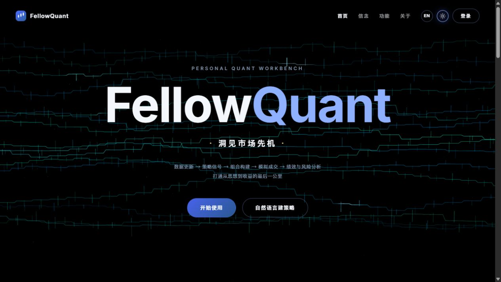
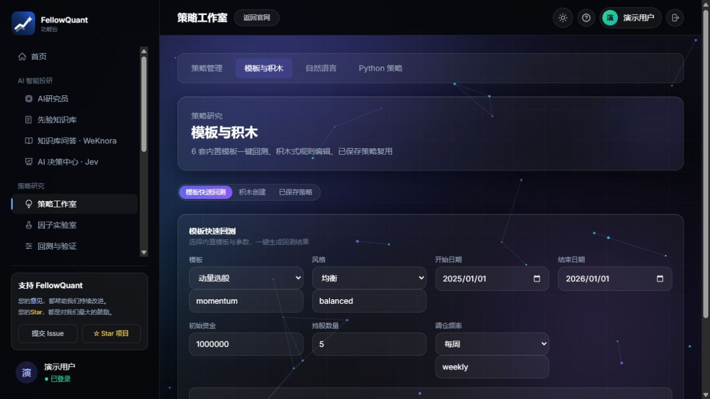
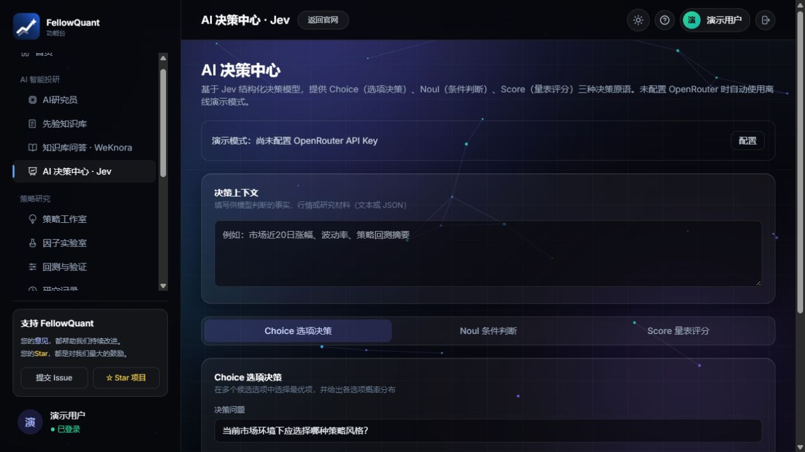

<p align="center">
  
</p>

<h1 align="center">FellowQuant · Quant Research Workbench</h1>

<p align="center">Turn investment ideas into research you can verify.</p>

<p align="center">
  <a href="README.md">简体中文</a> · <a href="README.en.md"><strong>English</strong></a>
</p>

<p align="center">
  
  
  
  <a href="LICENSE"></a>
</p>

## 🖥️ Screenshots

These screenshots show the running application with an isolated demo account. Results from unconfigured integrations are explicitly labeled as demonstrations.

**Brand homepage**



**Workspace: simplified navigation and strategy tools**



**Structured decisions with Jev**



## 📖 About

FellowQuant v4 is a research workbench for Chinese A-share markets, built with **Vue 3 and FastAPI**. It brings data updates, strategy creation, factor evaluation, backtesting, validation, and AI-assisted research into a single workflow.

v4 carries forward AlphaQuant's research capabilities with a separate frontend and backend. Strategy research has four primary navigation entries, with related tools available inside each page.

| Workspace | Capabilities |
| --- | --- |
| AI research | Research agents, account-specific prior knowledge, WeKnora retrieval and Q&A, Jev decisions |
| Strategy studio | Saved strategies, templates and rule blocks, natural-language creation, Python strategies |
| Factor lab | Built-in and custom factors, evaluation and combination research |
| Backtest and validation | Single backtests, parameter optimization, walk-forward validation, credibility audits, trade verification |
| Research history | Saved results and comparisons |
| Data management | Data assets, market updates, XTick, stock universes and risk settings |
| System | Account profile and per-account integration settings |

**Current scope:** Backtests and factor evaluation require downloaded market data. The monitoring dashboard uses simulated metrics. WeKnora and Jev require configured services or valid API keys; unconfigured integrations provide labeled demos, while configured service failures produce errors. The project supports research and simulation and does not execute trades with real funds.

## 🚀 Quick start

Install Python 3.11+, Node.js 18+, and Git.

```bash
git clone --branch fellowquant_v4 https://github.com/FelixZhang028/AlphaQuant.git
cd AlphaQuant
```

**Windows:** Run `start.bat` from the project root. It checks and installs required dependencies, then opens `http://127.0.0.1:5273`. Press any key in its console to stop the services it started.

**Manual startup / macOS / Linux:**

```bash
# Terminal 1: backend
cd dashboard/backend
python -m venv .venv
source .venv/bin/activate
# Windows PowerShell: .\.venv\Scripts\Activate.ps1
python -m pip install -r requirements.txt
python -m uvicorn app.main:app --host 127.0.0.1 --port 8000
```

```bash
# Terminal 2: homepage and workspace, starting from the project root
cd landing
npm ci
npm run dev -- --host 127.0.0.1
```

Register and sign in, update market data under Data Management, then create a strategy and run a backtest. API documentation is available at `http://127.0.0.1:8000/docs`.

The optional admin app and monitoring dashboard run from `admin/` and `dashboard/frontend/`. Use `npm ci` and `npm run dev` in each directory; their default ports are 5175 and 5174.

## ⚙️ Optional configuration

Copy `dashboard/backend/.env.example` to `.env` in the same directory. The backend loads it at startup. Model and WeKnora settings saved through the UI take precedence over the corresponding environment variables.

| Variable | Purpose |
| --- | --- |
| `APP_SECRET` | Token signing; when blank, a random persistent local key is generated |
| `FELLOWQUANT_ADMIN_EMAIL` / `FELLOWQUANT_ADMIN_PASSWORD` | Bootstrap an admin account; minimum password length is 12 characters, with no public default password |
| `OPENROUTER_API_KEY` | Jev decisions; also configurable under System → Settings |
| `WEKNORA_BASE_URL` / `WEKNORA_API_KEY` | WeKnora endpoint and workspace key; also configurable in the UI |
| `SMTP_HOST` / `SMTP_PORT` / `SMTP_FROM` | Password-reset email over STARTTLS; default port is 587 |
| `SMTP_USERNAME` / `SMTP_PASSWORD` | SMTP credentials when required by the mail provider |

Password reset is unavailable without SMTP configuration. Codes are delivered only to the registered mailbox and never returned to the browser. Resetting a password invalidates earlier login tokens. Local accounts, market data, run history, and credentials live in the backend's `data/` directory and are excluded from Git.

Deploy WeKnora and create knowledge bases before using the integration. Its API key needs the relevant read, retrieval, and chat permissions. Jev supports Choice, Noul, and Score decisions over text or JSON context; real requests may consume service credits. Natural-language strategies and research agents use chat models, while Jev is available through the separate decision center.

## 🧩 Project layout

```text
.
├── landing/              # Vue homepage, authentication, workspace and community
├── admin/                # Standalone admin app
├── dashboard/
│   ├── frontend/         # Monitoring dashboard
│   └── backend/
│       ├── app/          # FastAPI routes, authentication and database
│       ├── quant_platform/  # Research engine, WeKnora and Jev adapters
│       ├── trading_agents/  # AI research workflow
│       ├── configs/      # Data, strategy and risk configuration
│       └── tests/        # Regression tests
├── docs/images/          # Screenshots from the running app
├── scripts/start.ps1    # Windows service startup and cleanup
└── start.bat
```

## 🧪 Development and validation

```bash
cd dashboard/backend
python -m pip install -r requirements-dev.txt
python -m pytest -q
python -m compileall -q app quant_platform trading_agents
```

Run `npm ci` and `npm run build` separately in `landing/`, `admin/`, and `dashboard/frontend/`. Regression tests cover trade verification, external API contracts, account-isolated configuration, authentication, and password reset. External APIs are mocked in tests, so tests do not incur model charges.

## 🤝 Contributing

Report bugs or propose improvements through [Issues](https://github.com/FelixZhang028/AlphaQuant/issues), or open a Pull Request. Include steps to reproduce, expected behavior, and actual behavior.

Thanks to AlphaQuant for the research foundation, and to [WeKnora](https://github.com/Tencent/WeKnora) and [OpenRouter](https://openrouter.ai/) for their integration capabilities.

## 📄 License

Licensed under [GNU GPL v3](LICENSE).
